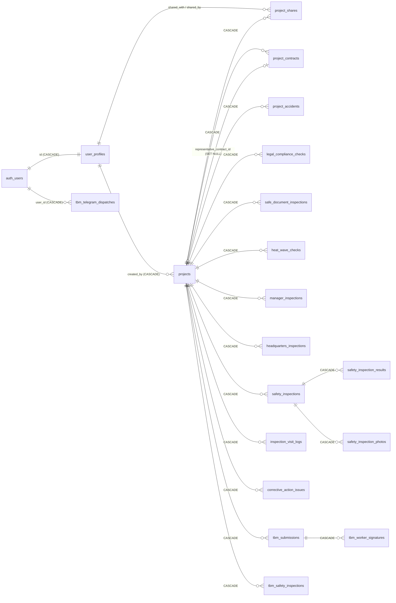
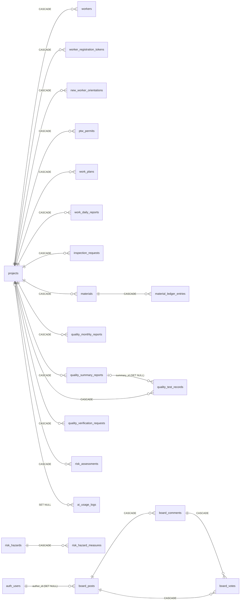

<!-- 현행 시스템 정의서 — 아키텍처·DB·라이브러리·외부연동·개발환경·규모를 한 곳에 정리한 인수인계/실사 대응 문서 -->
# SafeSys 현행 시스템 정의서

> 작성일 2026-09-03. 코드베이스 조사(Codex 워커, [조사 원문](./현행시스템_정의서_조사원문.md))와 운영 인프라 직접 조회(Supabase SQL·Vercel API·개발 PC)를 합쳐 정리했다.
> 표기 규칙. **[확인]** 은 코드·API로 검증한 사실, **[추정]** 은 근거로 미루어 판단한 값, **[확인 필요]** 는 이 조사로 얻을 수 없어 담당자가 채워야 하는 항목이다.
> 비밀값(API 키·토큰)은 기록하지 않았다. 환경 변수는 이름만 적었다.

---

## 1. 현행 시스템 아키텍처 정의서

### 1.1 소프트웨어 구성

| 구분 | 내용 | 근거 |
|---|---|---|
| 프로그래밍 언어 | TypeScript 5 (TSX 포함). `.ts/.tsx` 469개, 약 17.9만 줄 | `safesys-app/src` 집계 [확인] |
| 프런트엔드 프레임워크 | React 19.1.2, Next.js 15.5.12 (App Router) | `package-lock.json` 설치 버전 [확인] |
| 스타일 | Tailwind CSS 4, PostCSS | `package.json` [확인] |
| 서버(WAS 역할) | Next.js 내장 Node.js 서버. Route Handler 74개가 API 계층. Edge 런타임 미사용, `runtime='nodejs'` 명시 2건 | `src/app/api/**/route.ts` [확인] |
| 서버 런타임 | Node.js 22.x (Vercel 프로젝트 설정). 로컬 개발 PC는 Node 24.20.0, npm 11.19.0 | Vercel API `nodeVersion` [확인] |
| 백엔드(BaaS) | Supabase — PostgreSQL 17.4, Auth, Storage, Edge Function 1개(`update-user-password`) | Supabase SQL `version()` [확인] |
| 빌드 산출물 | `output: 'standalone'`, 전 경로 `Cache-Control: no-store`, 빌드 시 ESLint·TS 오류 무시 | `next.config.ts` [확인] |
| PWA | 자체 `public/sw.js` + `manifest.json` (앱명 "AI안전관리", standalone). next-pwa 등 라이브러리 미사용 | `ServiceWorkerRegistration.tsx` [확인] |
| 미들웨어 | `middleware.ts` 없음. 인증 검사는 클라이언트 `AuthContext`와 각 API 라우트에 분산 | [확인] |
| 컨테이너 | Dockerfile·docker-compose 없음. `netlify.toml`이 남아 있으나 실제 배포는 Vercel | [확인] |

### 1.2 배포 환경

| 항목 | 내용 |
|---|---|
| 실행 환경 | **외부 PaaS.** 프런트·API는 Vercel(서버리스 함수), DB·인증·파일은 Supabase(관리형 PostgreSQL). 개인 PC·자체 서버·Docker 운영 없음 [확인] |
| Vercel 프로젝트 | `safesys-app` (팀 "yoonhyuk's projects", 플랜 **Hobby**), 프레임워크 nextjs, 생성일 2025-07-30 [확인] |
| 배포 트리거 | GitHub `yoonhyuk12/safesys-app` (public) `main` 브랜치 푸시 → 자동 프로덕션 배포. 최근 20건 모두 `READY` [확인] |
| 도메인 | `krcsafesys.com` (운영), `safesys.vercel.app`, `safesys-app.vercel.app` 외 2개 [확인] |
| 서버리스 함수 | 배포당 Node.js 람다 6개 (`lambdaRuntimeStats`), 메모리·시간·리전 커스텀 없음(`vercel.json`은 install/build 명령만) [확인] |
| 함수 리전 | Vercel 기본값 `iad1`(미국 동부) [추정] — **[확인 필요]** Vercel 대시보드 Functions Region |
| Supabase 리전 | **[확인 필요]** 대시보드 Project Settings > General |
| 소스 관리 | Git 커밋 913개, 저장소 첫 커밋 2025-09-23 (서비스 첫 가입자 2025-07-29, Vercel 생성 2025-07-30이므로 그 전 이력은 별도 저장소) [확인] |

### 1.3 서버 사양

Vercel·Supabase 모두 관리형이라 물리 서버 사양이 없다. 아래는 제공자 구성값이다.

| 구성요소 | CPU | RAM | 디스크 | GPU |
|---|---|---|---|---|
| Vercel Serverless (Hobby) | 함수당 기본 1 vCPU, 최대 실행 10초 [추정: Vercel 공표 기본값] | 1024 MB [추정] | 없음(무상태) | 없음 |
| Supabase PostgreSQL | `max_connections` 60, `shared_buffers` 224MB, `effective_cache_size` 384MB, `max_worker_processes` 6 → **Micro 컴퓨트(2-core ARM 공유, 1GB RAM)로 추정** | 1 GB [추정] | DB 사용량 369 MB (디스크 할당은 대시보드 확인) | 없음 |
| 개발 PC (로컬) | Intel Core Ultra 7 356H, 16코어 | 32 GB | C: 사용 169 GB / 여유 783 GB | NVIDIA RTX 5060 Laptop 4GB (AI 코딩 도구는 클라우드 모델이라 로컬 GPU 미사용) |

- 앱 자체는 GPU를 쓰지 않는다. AI 기능은 전부 OpenAI·Google API 호출이다 [확인].
- **[확인 필요]** Supabase 대시보드 Compute Add-on 실제 등급, Vercel 함수 메모리 설정.

### 1.4 클라우드 서비스 사용 내역

| 서비스 | 사용 장비/자원 | 용량(2026-09-03 조회) | 비용 |
|---|---|---|---|
| Vercel | Hobby 플랜, 서버리스 함수 6개, CDN, 도메인 연결 | 대역폭·함수 실행량은 **[확인 필요]** (Vercel Usage) | Hobby는 무료 [확인]. 상용 서비스 약관상 Pro 전환 필요 여부 검토 권장 |
| Supabase Database | PostgreSQL 17.4, public 테이블 42개 | DB 369 MB (public 최대 테이블 `tbm_submissions` 33MB, `safety_inspections` 33MB, `risk_hazards` 24MB) | **[추정]** Pro 플랜(월 $25) + Micro 컴퓨트 포함. Storage 12GB가 Free 한도(1GB)를 넘으므로 Free는 아님. **[확인 필요]** Billing 페이지 |
| Supabase Storage | 공개 버킷 7개 | **총 약 12.0 GB, 53,068개 객체.** tbm-photos 4.8GB(41,950개) · inspection-photos 3.0GB · safety-inspection-photos 2.7GB · heatwave-inspections 0.7GB · quality-test-photos 0.5GB · worker-id-cards 0.2GB · work-plans 0.1GB | Pro 포함 100GB 이내 [추정] |
| Supabase Auth | 이메일 사용자 1,162명, MAU 234 | Pro 포함 100,000 MAU 이내 | 포함 |
| Supabase Edge Function | `update-user-password` 1개 | 미미 | 포함 |
| OpenAI API | gpt-5.6-luna(채팅·생성·OCR), tts-1(음성) | 2026-08 469회 / 47.8만 토큰, 2026-09 3일간 426회 | 종량제. 단가는 `ai_model_settings`에 기록. **[확인 필요]** OpenAI 청구서 |
| Google Gemini API | gemini-flash-lite-latest (위험성평가·분류·계획서) | 위 로그에 합산 | 종량제 **[확인 필요]** |
| 기타 무료·공공 API | 기상청 API Hub, 공공데이터포털, 나라장터, VWorld, Kakao 지도, Telegram Bot, SMTP(Nodemailer) | — | 무료 |
| GitHub | public 저장소 1개 | — | 무료 |

### 1.5 본인인증 방식

| 항목 | 내용 |
|---|---|
| 일반 사용자 로그인 | Supabase Auth **이메일 + 비밀번호**(`signInWithPassword`). 가입 시 이메일 확인 필요, 24시간 내 미확인 계정은 `pg_cron`(3시간 주기)이 삭제 [확인] |
| 소셜/OAuth/전화 인증 | 없음. `auth.identities` provider는 `email` 단일 [확인] |
| 휴대폰 본인확인(PASS·NICE·KCB) | **연동 없음.** 전화번호는 프로필 입력값과 아이디 찾기 조회 키로만 사용 [확인]. **[확인 필요]** 오프라인 본인확인 절차 유무 |
| 세션 | 브라우저 supabase-js가 JWT를 localStorage에 보관, 자동 갱신. `@supabase/ssr` 서버 쿠키 세션 미사용 [확인] |
| 관리자 로그인 | 별도 관리자 ID + **이메일 OTP** (Nodemailer로 발송, `admin_otp_codes` 테이블 검증) [확인] |
| 권한 | 역할 3종(발주청·감리단·시공사) + 본부/지사 조직 계층. DB RLS 정책 170개로 행 단위 제어 [확인] |
| 작업자(비회원) | QR 등록 토큰(`worker_registration_tokens`)으로 로그인 없이 개인정보·서명 제출 [확인] |
| 전자서명 | `react-signature-canvas`로 그린 PNG를 base64 데이터 URL로 DB(TEXT/JSONB)에 저장. 공인·공동인증서 아님 [확인] |

---

## 2. 데이터 모델링 및 DB 명세서

### 2.1 DB 종류 및 버전

- **PostgreSQL 17.4** (aarch64 Linux, Supabase 관리형) [확인]
- 설치 확장: `uuid-ossp`, `pgcrypto`, `pg_stat_statements`, `pg_cron 1.6`, `supabase_vault`, `plpgsql` [확인]
- public 스키마 요약 [확인]

| 항목 | 수 |
|---|---|
| 테이블 | 42 (전부 RLS 활성) |
| RLS 정책 | 170 |
| 외래키 | 71 |
| 함수 | 28 (`merge_projects`, `transfer_project_ownership`, `classify_inspection_finding`, `reserve_tbm_telegram_dispatch` 등) |
| 마이그레이션 SQL 파일 | `database/` 88개 + `database/migrations/` 16개 (2026-02-11 ~ 2026-08-31) |
| cron job | 1 (미확인 계정 정리, 3시간 주기) |

### 2.2 ERD (테이블 관계도)

`projects`를 중심으로 25개 업무 테이블이 `ON DELETE CASCADE`로 매달리는 **허브-스포크 구조**다. 사용자 관련 FK는 `auth.users`(SET NULL) 또는 `user_profiles`를 가리킨다. 아래는 라이브 DB의 71개 FK를 기반으로 그린 관계도이며, 읽기 쉽도록 두 도식으로 나눴다. 두 도식의 `projects`는 같은 테이블이다.

**도식 A. 사용자·프로젝트·안전점검·TBM**



**도식 B. 작업자·작업·자재·품질·위험성평가·AI·게시판**



독립 테이블(FK 없음): `ai_model_settings`, `admin_otp_codes`, `ui_settings`, `risk_hazards`(공사 위험요인 사전 DB).
그 밖에 업무 테이블 21개가 `created_by → auth.users (SET NULL)` FK를 가진다(도식에서 생략).

### 2.3 테이블 명세서

행 수는 PostgreSQL 통계 추정치(`reltuples`), 크기는 인덱스·TOAST 포함 총량이다(2026-09-03).

| 영역 | 테이블 | 용도 | 컬럼 | 행(추정) | 크기 |
|---|---|---|---|---|---|
| 사용자·조직 | `user_profiles` | 회원 프로필(역할·본부·지사·회사) | 15 | 1,117 | 568 kB |
| | `admin_otp_codes` | 관리자 OTP 발급 이력 | 7 | 1 | 48 kB |
| | `ui_settings` | 본부별 UI 토글 | 6 | 8 | 80 kB |
| 프로젝트 | `projects` | 공사 현장(사업) 마스터, CCTV RTSP URL 포함 | 43 | 1,018 | 896 kB |
| | `project_shares` | 프로젝트 공유 사용자 | 5 | 29 | 72 kB |
| | `project_contracts` | 나라장터 계약 정보 | 21 | 967 | 736 kB |
| | `project_accidents` | 사고 이력·산재신청 여부 | 20 | 10 | 112 kB |
| | `legal_compliance_checks` | 법정 안전관리 이행 점검 | 8 | 128 | 240 kB |
| | `safe_document_inspections` | 안전 서류 점검 | 16 | 178 | 392 kB |
| 안전 점검 | `heat_wave_checks` | 폭염 점검 | 16 | 1,395 | 984 kB |
| | `manager_inspections` | 관리자 점검 | 17 | 542 | 18 MB |
| | `headquarters_inspections` | 본부 불시점검(조치 사진 추적) | 25 | 471 | 18 MB |
| | `safety_inspections` | 안전 점검 본표 | 23 | 219 | 33 MB |
| | `safety_inspection_results` | 점검 항목 결과 | 10 | 348 | 440 kB |
| | `safety_inspection_photos` | 점검 사진 메타 | 9 | 262 | 152 kB |
| | `inspection_visit_logs` | 점검 방문일지 | 20 | 소량 | 288 kB |
| | `corrective_action_issues` | 지적·시정조치 | 17 | 소량 | 48 kB |
| TBM | `tbm_submissions` | 시공사 TBM 일일보고 (최대 행 수) | 47 | 22,699 | 33 MB |
| | `tbm_worker_signatures` | TBM 작업자 서명(base64) | 11 | 252 | 15 MB |
| | `tbm_safety_inspections` | TBM 안전활동 점검표(감독) | 37 | 605 | 8.9 MB |
| | `tbm_telegram_dispatches` | TBM 텔레그램 발송 상태 | 8 | 26 | 136 kB |
| 작업자·작업 | `workers` | 작업자 명부 | 28 | 112 | 216 kB |
| | `worker_registration_tokens` | QR 등록 토큰 | 6 | 674 | 408 kB |
| | `new_worker_orientations` | 신규 작업자 교육 | 17 | 124 | 14 MB |
| | `ptw_permits` | 작업허가서 | 13 | 28 | 2.0 MB |
| | `work_plans` | 작업계획서 | 13 | 14 | 2.5 MB |
| | `work_daily_reports` | 작업일보 | 19 | 844 | 1.7 MB |
| | `inspection_requests` | 검측 요청 | 33 | 5 | 288 kB |
| 자재 | `materials` | 주요자재 목록 | 21 | 422 | 272 kB |
| | `material_ledger_entries` | 자재 수불 원장 | 24 | 1,287 | 2.0 MB |
| 품질 | `quality_monthly_reports` | 품질 월례보고 | 11 | 126 | 200 kB |
| | `quality_summary_reports` | 품질 총괄표 | 28 | 12 | 864 kB |
| | `quality_test_records` | 품질 시험 실시대장 | 23 | 620 | 22 MB |
| | `quality_verification_requests` | 품질 검증 요청 | 19 | 소량 | 152 kB |
| 위험성평가 | `risk_assessments` | 수시 위험성평가서(표·서명 JSONB) | 14 | 87 | 3.5 MB |
| | `risk_hazards` | 농어촌공사 유해·위험요인 사전 DB | 15 | 18,259 | 24 MB |
| | `risk_hazard_measures` | 위험요인별 감소대책 | 4 | 62,316 | 21 MB |
| AI | `ai_model_settings` | 기능별 제조사·모델·단가 | 11 | 22 | 96 kB |
| | `ai_usage_logs` | AI 호출 1건 1행 | 13 | 817 | 360 kB |
| 게시판 | `board_posts` / `board_comments` / `board_votes` | 요청사항 게시판 | 12/9/6 | 소량 | 150 kB |

컬럼 단위 상세는 `database/*.sql`이 원본이며, 라이브 스키마는 Supabase MCP `list_tables`(verbose)로 뽑을 수 있다.

### 2.4 테이블 크기·증가율, CCTV 영상 관리 여부

**크기.** DB 369 MB, Storage 12.0 GB. 용량의 97%가 사진 파일(Storage)이고 DB에서 큰 부분은 base64 서명·사진 JSON이 든 점검·TBM 테이블이다.

**증가율(월별, 2026년).**

| 월 | Storage 신규 객체 | Storage 신규 용량 | TBM 제출 | 신규 가입 |
|---|---|---|---|---|
| 3월 | 10,124 | 2.6 GB | 4,719 | 100 |
| 4월 | 8,818 | 2.4 GB | 4,080 | 46 |
| 5월 | 5,250 | 0.7 GB | 2,714 | 82 |
| 6월 | 6,218 | 1.2 GB | 2,796 | 100 |
| 7월 | 5,074 | 1.0 GB | 2,268 | 158 |
| 8월 | 5,705 | 1.4 GB | 2,311 | 79 |

- 최근 6개월 평균 Storage 증가 **약 1.5 GB/월**, 연간 약 18 GB 예상. 공사 성수기(3~4월)에 2배 이상 뛴다.
- DB 자체는 월 수십 MB 수준이라 컴퓨트 등급보다 Storage 요금이 먼저 늘어난다.

**CCTV 영상 데이터.** **관리하지 않는다.** `projects` 테이블에 현장 CCTV의 RTSP URL 문자열만 보관하고, 영상 저장·재생·녹화 기능은 없다 [확인]. 개인정보 동의서에 CCTV 수집·제3자 제공 문구가 있고, 알림은 외부 Edge Function(`AICCTV_ALERT_FUNCTION_URL`)으로 전송만 한다. 영상 자체는 별도 시스템(AI CCTV) 소관이다.

---

## 3. 소스코드 및 라이브러리 명세서

### 3.1 소스코드 형상

- 저장소: GitHub `yoonhyuk12/safesys-app` (public), 기본 브랜치 `main`, 커밋 913개 [확인]
- 최상위 구조

| 경로 | 내용 |
|---|---|
| `safesys-app/` | Next.js 앱 본체 (`src/app` 173, `src/components` 155, `src/lib` 142 파일) |
| `database/` | SQL 마이그레이션 88개 + `migrations/` 16개 |
| `docs/` | 지식 베이스(아키텍처·DB·인증·환경·트러블슈팅) |
| `plans/`, `plan/` | 기능 계획서 |
| `wiki/검사기준/` | 공종별 검사 기준 위키 |
| `.claude/` | AI 코딩 도구 설정(에이전트·규칙·스킬·훅) |
| `CLAUDE.md`, `AGENTS.md`, `.cursorrules` | AI 도구용 프로젝트 지침 |

- **압축 파일 제공 방법.** 추적 파일만 담는 `git archive`를 쓰면 `node_modules`·`.next`·`.env.local`(비밀값)이 자동으로 빠진다. 미커밋 변경이 있으면 먼저 커밋한다.

```bash
git archive --format=zip -o safesys-src_20260903.zip HEAD
```

- 라이선스: `package.json`에 `license` 필드 없음. **[확인 필요]** 납품 라이선스 정책.

### 3.2 외부 라이브러리

런타임 의존성 26개, 개발 의존성 13개. 버전은 `package.json` 선언값이다 [확인].

| 용도 | 패키지 | 버전 |
|---|---|---|
| 프레임워크 | next / react / react-dom | ^15.5.0 / 19.1.2 / 19.1.2 |
| BaaS 클라이언트 | @supabase/supabase-js, @supabase/auth-ui-react, @supabase/auth-ui-shared | ^2.53.0, ^0.4.7, ^0.1.8 |
| PDF 생성 | jspdf, html2canvas | ^3.0.1, ^1.4.1 |
| Excel | exceljs, xlsx | ^4.4.0, ^0.18.5 |
| 한글(HWPX)·DOCX | jszip(HWPX 패키징), docx | ^3.10.1, ^9.6.1 |
| 지도 | leaflet, react-leaflet, @types/leaflet | ^1.9.4, ^5.0.0, ^1.9.20 |
| 전자서명 | react-signature-canvas | ^1.1.0-alpha.2 |
| QR | qrcode.react | ^4.2.0 |
| HTTP·크롤링 | axios, cheerio | ^1.11.0, ^1.1.2 |
| 이메일 | nodemailer | ^9.0.3 |
| 유틸 | date-fns, uuid, clsx, lucide-react(아이콘) | ^4.1.0, ^11.1.0, ^2.1.1, ^0.533.0 |
| 개발 보조 | agentation | ^1.3.2 (AI 코딩 에이전트용 화면 피드백 오버레이. `layout.tsx`에서 개발 모드에만 렌더) |
| 개발: 언어·린트 | typescript ^5, eslint ^9, eslint-config-next ^15.5.0, @eslint/eslintrc ^3 | |
| 개발: 스타일 | tailwindcss ^4, @tailwindcss/postcss ^4 | |
| 개발: 테스트 | @playwright/test ^1.57.0 | |
| 개발: 도구 | supabase(CLI) ^2.31.8, cross-env ^10.0.0, @types/* | |

- 미사용 항목: 상태관리 라이브러리, 폼 라이브러리, 차트, Radix/shadcn, `@anthropic-ai/sdk`·`openai`·`ai` SDK (AI는 REST 직접 호출), `pdf-lib`, Kakao/Naver SDK 패키지(스크립트 태그로 로드).
- CDN 로드: Kakao 지도 SDK, Leaflet CSS/아이콘, OpenStreetMap 타일.

---

## 4. 외부 API 및 인터페이스 명세서

### 4.1 외부 연동 목록

| 분류 | 연동 대상 | 용도 | 인증 (환경 변수명) |
|---|---|---|---|
| AI | OpenAI API (chat completions, models, TTS) | 현장 AI 비서·TBM 챗봇, 위험분석·의견 생성, 이수증 OCR, 번역, 음성합성 | `OPENAI_API_KEY` (Bearer) |
| AI | Google Gemini API (`generateContent`) | 위험성평가 판정·분류, 작업계획서 초안, 검측 체크리스트 | `GEMINI_API_KEY` |
| 기상 | 기상청 API Hub | 기상특보·폭염 경보 | `KMA` 계열 authKey |
| 기상 | 공공데이터포털 기상청 서비스 | 단기예보, 생활기상지수(체감온도) | `NEXT_PUBLIC_KMA_API_KEY` |
| 조달 | 나라장터(G2B) 공공데이터 | 계약 정보·검사대가 조회, 프로젝트 자동 갱신 | `DATA_GO_KR_API_KEY` |
| 품질 | 건설공사 품질관리(CSI) API | 품질보고서 조회 | `CSI_API_KEY` |
| 지도 | VWorld (국토부) | 주소→좌표 지오코딩, 배경지도 | `NEXT_PUBLIC_VWORLD_API_KEY` |
| 지도 | Kakao 지도 SDK / Naver·Tmap 길찾기 링크 | 현장 위치 표시·내비 연결 | Kakao JS 앱키(`layout.tsx`에 하드코딩, 도메인 제한 키) |
| 지도 | OpenStreetMap 타일 + Leaflet CDN | 지도 렌더링 | 없음 |
| 메시징 | Telegram Bot API | TBM 결과·사진 발송 | `TELEGRAM_BOT_TOKEN` |
| 메시징 | SMTP (Nodemailer) | 관리자 OTP 메일 | `ADMIN_MAIL_USER`, `ADMIN_MAIL_PASS` |
| 알림 | AI CCTV 알림앱 Edge Function | 앱 푸시 알림 전달 | `AICCTV_ALERT_FUNCTION_URL`, `AICCTV_ALERT_ANON_KEY` |
| 레거시 | Google Apps Script 웹앱 | TBM 데이터 조회·안전서류 제출(고정 URL) | 없음 (URL 자체가 접근 키 역할) |
| 기타 | ipify | 가입 시 공인 IP 기록 | 없음 |
| BaaS | Supabase (Auth·PostgREST·Storage·Edge Function) | 전 데이터 계층 | `NEXT_PUBLIC_SUPABASE_URL`, `NEXT_PUBLIC_SUPABASE_ANON_KEY`, `SUPABASE_SERVICE_ROLE_KEY` |

미연동: 휴대폰 본인확인, SMS 발송(Solapi 등), FCM/Web Push, 결제.

### 4.2 연동 방식

- **모두 HTTPS REST 호출(JSON, 일부 XML)** 이며, 서버 측 Route Handler에서 `fetch`/`axios`로 호출한다. 비밀키는 서버 전용 환경 변수에 두고 브라우저에는 `NEXT_PUBLIC_*` 공개 키만 노출한다.
- Supabase는 supabase-js SDK(브라우저는 anon key + RLS, 서버 관리 작업은 service role key).
- 웹훅 수신은 없다. 모든 연동이 아웃바운드다.
- AI 호출은 `ai_model_settings` 테이블로 기능별 모델을 바꿀 수 있고, 호출마다 `ai_usage_logs`에 토큰·소요시간을 남긴다. Gemini는 모델 폴백 체인이 있다.
- 지도는 사용자 브라우저가 Kakao/VWorld/OSM에 직접 접속한다(서버 경유 없음, `map-tile` 프록시 라우트 일부 예외).

---

## 5. 개발환경

| 항목 | 내용 |
|---|---|
| 운영체제 | Windows 11 Home 24H2 (10.0.26200), Lenovo 노트북 [확인]. 저장소는 크로스플랫폼(`cross-env`, POSIX 경로) |
| 프로그래밍 언어 | TypeScript 5 / TSX, SQL(PostgreSQL), 소량 JavaScript(훅·스크립트) |
| 런타임·도구 | Node.js 24.20.0, npm 11.19.0, Git 2.55, Supabase CLI, Vercel CLI(`.vercel/` 링크) |
| 편집기 | **[확인 필요]** (VS Code·Cursor 등). `.cursorrules` 존재 |
| 린트·타입 | ESLint 9 + eslint-config-next, `tsc --noEmit`. Prettier 없음 |
| 테스트 | Playwright (`tests/` 스펙 9개, 단위 테스트 `.test.mjs` 포함). Vitest/Jest 없음 |
| AI 코딩 툴 | **Claude Code**(주 도구, `.claude/` 설정·훅·스킬·`worker-opus` 서브에이전트), **OpenAI Codex CLI**(조사·보조 워커), **Orca**(멀티 에이전트 오케스트레이션 데스크톱), Cursor 규칙 파일 |
| AI 모델(개발용) | Claude Opus 5 / Claude Fable 5.1(커밋 Co-Author 기록), GPT 계열(Codex) |
| AI 모델(앱 런타임) | `gpt-5.6-luna`, `tts-1`, `gemini-flash-lite-latest`(폴백 `gemini-3.1-flash-lite`) |
| 프롬프트·컨텍스트 파일 | `CLAUDE.md`(목차·핵심 제약 5개), `AGENTS.md`, `.cursorrules`, `docs/*.md` 7편, `docs/superpowers/{plans,specs}`, `plans/*.md`, `wiki/검사기준/**`, `.claude/agents/worker-opus.md`, `.claude/rules/**`(공통·언어별), `.claude/skills/**`(feature-workflow, hwpx-authoring, worklog 등), `.claude/skills-anthropic/**`, `.claude/commands/*.md`, `.claude/contexts/*.md`, `.claude/hooks/`(worklog Stop 훅), `.claude/settings.json` |

---

## 6. WEB 서버와 WAS 서버의 물리적 분리 여부

**분리하지 않았다.** 전통적 WEB(정적)/WAS(동적) 2계층이 아니라 서버리스 구조다.

- Next.js 한 프로젝트가 페이지 SSR과 API(Route Handler 74개)를 함께 제공하며, Vercel이 이를 **Edge CDN(정적 자산·캐시) + Serverless Function(SSR·API)** 로 자동 분리 배포한다. 즉 논리적으로는 정적 계층과 동적 계층이 나뉘지만, 운영자가 관리하는 별도 WEB 서버·WAS 서버 장비는 없다.
- DB·인증·파일 저장소는 Supabase가 별도 인프라에서 제공하므로 **앱 계층과 데이터 계층은 물리적으로 분리**돼 있다.
- 자체 Express/Spring 같은 백엔드 서버는 없다.
- 참고: `next.config.ts`가 전 경로에 `no-store`를 걸어 CDN 캐시를 사실상 끄고 있어, 정적 계층의 이점이 일부 상쇄된다.

```
[브라우저/PWA] --HTTPS--> [Vercel Edge CDN] --> [Vercel Serverless: Next.js SSR + API]
                                                          |
                    +-------------------------------------+------------------+
                    v                                     v                  v
     [Supabase Postgres/Auth/Storage]            [OpenAI / Gemini]   [기상청·나라장터·VWorld·Telegram]
```

---

## 7. 사용자 수, 동시접속자 수

Supabase `auth` 스키마 직접 조회(2026-09-03 10:05 KST) [확인].

| 지표 | 값 |
|---|---|
| 누적 가입 사용자 | **1,162명** (이메일 인증 완료 기준) |
| 역할별 | 시공사 649 · 발주청 505 · 감리단 8 |
| 월간 활성 사용자(30일 내 로그인) | **234명** |
| 주간 활성 사용자(7일) | 72명 |
| 일간 활성(24시간 내 세션 갱신) | 175명 |
| 최근 1시간 내 활동 사용자 | 44명 (평일 오전 10시 기준) |
| 월 신규 가입 | 2026년 월평균 약 90명 (최대 7월 158명) |
| 관리 대상 프로젝트(현장) | 1,020개 |
| 등록 작업자(비회원) | 130명 |

**동시접속자 추정.** 세션 갱신 기준 시간당 활동자 44명이 실질 동시 사용자 상한에 가깝다. 서버리스라 앱 서버 동시 접속 제한은 없고, 병목은 Supabase 직접 연결 60개(PostgREST 풀러 경유라 실사용에는 여유)다. **피크 동시접속 실측값은 [확인 필요]** — Vercel Analytics 또는 Supabase Reports > API 요청 수 그래프로 확인한다.

---

## 8. 담당자가 채워야 할 항목 (요약)

1. Supabase 리전, 컴퓨트 등급, 월 청구액 (Billing)
2. Vercel 함수 리전·메모리, 대역폭·함수 실행 사용량, Pro 전환 여부
3. OpenAI·Gemini 월 청구액
4. 피크 동시접속(Vercel Analytics / Supabase Reports)
5. 소스 라이선스 정책, 편집기·IDE 표준
6. 오프라인 본인확인 절차 유무

## 9. 조사 중 발견한 개선 권고

- Kakao 지도 JS 앱키가 `src/app/layout.tsx`에 하드코딩돼 있다. 도메인 제한 키라 즉시 위험은 아니지만 `NEXT_PUBLIC_KAKAO_MAP_KEY`로 옮기는 것이 좋다.
- Google Apps Script 웹앱 URL이 코드에 고정돼 있고 인증이 없다. 대체(Route Handler 이관) 또는 환경 변수화를 권고한다.
- Vercel Hobby 플랜은 상업적 이용을 제한한다. 발주처 납품 서비스라면 Pro 전환을 검토한다.
- `next.config.ts`의 빌드 시 ESLint·TypeScript 오류 무시 설정은 납품 전 해제해 타입 오류를 빌드에서 잡는 편이 안전하다.
- Storage 버킷 7개가 모두 public이다. 작업자 신분증(`worker-id-cards`)은 서명된 URL 방식으로 전환을 검토한다.
- `agentation`은 개발 모드 전용 AI 에이전트 보조 도구인데 런타임 `dependencies`에 있어 프로덕션 번들에 포함된다. `devDependencies`로 옮기거나 동적 import로 바꾸는 것을 권고한다.
